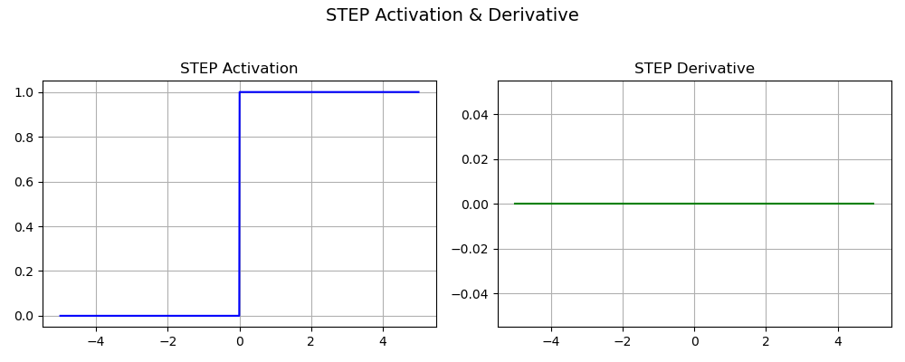
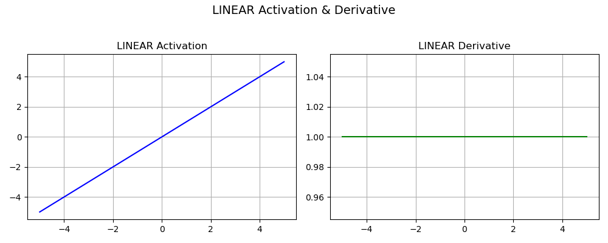
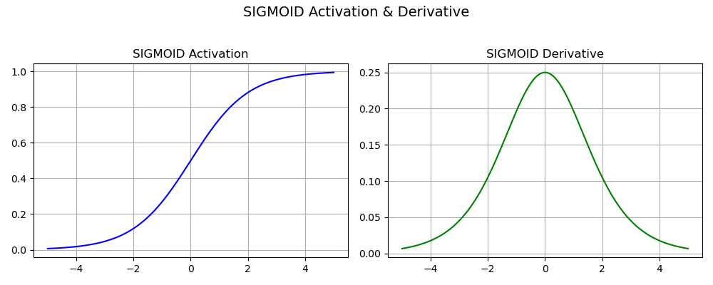
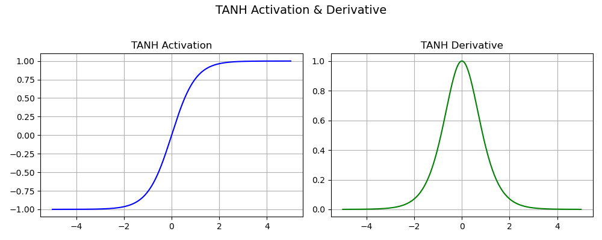
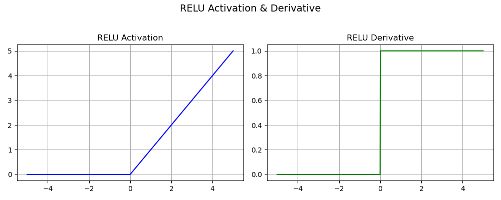
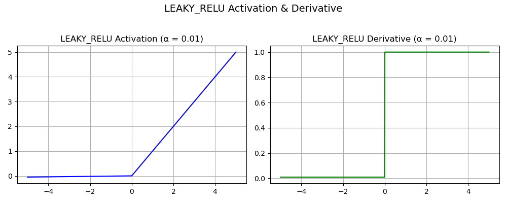
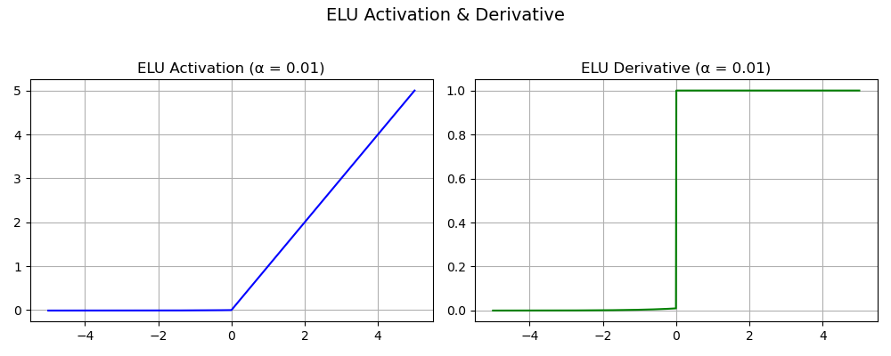
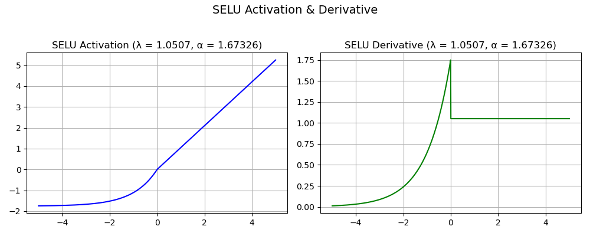
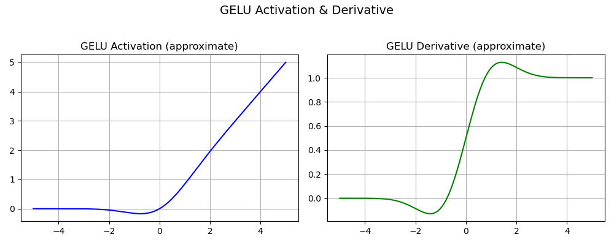
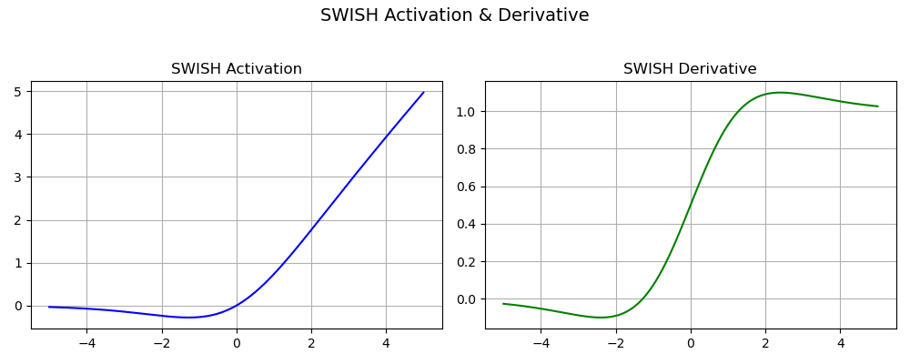

# Activation Functions

## Table of Contents

1. [Introduction](#introduction)
2. [Step Function](#step-function)
3. [Linear Activation](#linear-activation)
4. [Sigmoid Function](#sigmoid-function)
5. [Tanh Function](#tanh-function)
6. [ReLU Function](#relu-function)
7. [Leaky ReLU](#leaky-relu)
8. [The Risk of Vanishing or Exploding Gradients](#the-risk-of-vanishing-or-exploding-gradients)
9. [Impact of Activation Functions on Model Performance](#impact-of-activation-functions-on-model-performance)
10. [Conclusion](#conclusion)

## Introduction

Activation functions in neural networks are mathematical functions that determine the output of a neuron based on its input. They introduce non-linearity, allowing neural networks to learn complex patterns in data. These functions decide whether a neuron should be activated or not, and how strongly its signal is passed to the next layer.

Given an input vector $x \in \mathbb{R}^d$ and weights $w \in \mathbb{R}^d$, the neuron output before activation is:

$$
z = w^\top x + b
$$

Then the activation function $f(z)$ is applied:

$$
a = f(z)
$$

### Types of Activation Functions

Several different types of activation functions are used in Deep Learning. Some of them are explained below:

1. Step Function
2. Linear Activation
3. Sigmoid Function
4. Tanh Function
5. ReLU Function
6. Leaky ReLU

## Step Function

The Step Function is one of the earliest activation functions, used in perceptrons to make binary decisions.

### Definition

$$
f(x) =
\begin{cases}
1 & \text{if } x \geq 0 \\
0 & \text{if } x < 0
\end{cases}
$$

This is also known as the Heaviside Step Function.

### Properties

* Output Range: $\{0, 1\}$
* Non-linear
* Not differentiable at $x = 0$
* No gradient, so not used in training modern neural networks
* Used in early binary classifiers (e.g., Perceptrons)

Its graph jumps from 0 to 1 at $x = 0$, with no smooth transition.

## Linear Activation

The Linear Activation Function (identity function) is defined as:

### Definition

$$
f(x) = x
$$

### Derivative

$$
\frac{df}{dx} = 1
$$

### Properties

* Output Range: $(-\infty, \infty)$
* No non-linearity as it just passes input as output
* Differentiable
* Used in the output layer of regression models
* Not suitable for hidden layers (makes stacked layers equivalent to a single layer)

## Sigmoid Function

The sigmoid (logistic) function maps any real value to the (0, 1) interval.

### Function Definition

$$
\sigma(z) = \frac{1}{1 + e^{-z}}
$$

### Properties

* Output Range: $(0, 1)$ i.e convenient to generate probabilities as output.
* Non-linear
* The function is differentiable and the gradient is smooth, i.e. no jumps in the ouput values.
* Used in binary classification

**Cons**

* The sigmoid’s derivative vanishes at its extreme input values ($z \rightarrow - \infty$ and $z \rightarrow \infty$) and is thus proned to the issue called Vanishing Gradient problem.

### Derivative

We need to compute:

$$
\frac{d}{dz} \sigma(z)
$$

Let:

$$
\sigma(z) = \frac{1}{1 + e^{-z}}
$$

Differentiate:

$$
\begin{align*}
\frac{d}{dz} \sigma(z) &= \frac{d}{dz} \left(1 + e^{-z}\right)^{-1} \\
&= -1 \cdot (1 + e^{-z})^{-2} \cdot (-e^{-z}) \\
&= \frac{e^{-z}}{(1 + e^{-z})^2}
\end{align*}
$$

Now rewrite in terms of $\sigma(z)$:

$$
\boxed{
\frac{d}{dz} \sigma(z) = \sigma(z)(1 - \sigma(z))
}
$$

## Tanh Function

The hyperbolic tangent maps real values to the range $(-1, 1)$. It's a scaled and shifted version of the sigmoid.

### Function Definition

$$
\tanh(z) = \frac{e^{z} - e^{-z}}{e^{z} + e^{-z}}
$$

### Properties

* Output Range: $(-1, 1)$
* Zero-centered output
* Smooth and differentiable

**Cons**

* The gradient is much steeper than for the sigmoid (risk of jumps while descending)

* There is also a Vanishing Gradient problem due to the derivative cancelling for $z \rightarrow - \infty$ and $z \rightarrow \infty$.

### Derivative

We use:

$$
\frac{d}{dz} \tanh(z) = 1 - \tanh^2(z)
$$

#### Proof

Let $t = \tanh(z)$:

$$
\frac{d}{dz} \tanh(z) = \frac{d}{dz} \left( \frac{e^z - e^{-z}}{e^z + e^{-z}} \right)
$$

Using quotient rule:

Let:

* $u = e^z - e^{-z}$
* $v = e^z + e^{-z}$

Then:

$$
\frac{d}{dz} \tanh(z) = \frac{u'v - uv'}{v^2}
$$

Compute:

* $u' = e^z + e^{-z}$
* $v' = e^z - e^{-z}$

So:

$$
\frac{d}{dz} \tanh(z) = \frac{(e^z + e^{-z})(e^z + e^{-z}) - (e^z - e^{-z})(e^z - e^{-z})}{(e^z + e^{-z})^2}
$$

Simplify numerator:

$$
(a + b)^2 - (a - b)^2 = 4ab \Rightarrow \text{So numerator becomes: } 4
$$

So:

$$
\frac{d}{dz} \tanh(z) = \frac{4}{(e^z + e^{-z})^2}
$$

But:

$$
\tanh(z) = \frac{e^z - e^{-z}}{e^z + e^{-z}} \Rightarrow \tanh^2(z) = \left( \frac{e^z - e^{-z}}{e^z + e^{-z}} \right)^2
$$

And:

$$
1 - \tanh^2(z) = \frac{(e^z + e^{-z})^2 - (e^z - e^{-z})^2}{(e^z + e^{-z})^2} = \frac{4}{(e^z + e^{-z})^2}
$$

Therefore:

$$
\boxed{
\frac{d}{dz} \tanh(z) = 1 - \tanh^2(z)
}
$$

## ReLU Function

Rectified Linear Unit is widely used in deep learning due to its simplicity and efficiency.

### Function Definition

$$
\text{ReLU}(z) = \max(0, z)
$$

### Properties

* Output Range: $[0, \infty)$
* Not differentiable at $z = 0$
* Computationally efficient
* Sparse activations
* Better gradient descent as the function does not saturate in both directions like the sigmoid and tanh. In other words, the Vanishing Gradient problem is half reduced.

**Cons**

* Unlike the hyperbolic tangent, it is not zero-centered
* The range is infinite for positive input value (not bounded)
* ReLU is not differentiable at zero (but this can be solved by choosing arbitrarily a value for the derivative of either 0 or 1 for $z=0$)
* The “Dying ReLU problem”

### Derivative

$$
\frac{d}{dz} \text{ReLU}(z) =
\begin{cases}
1 & \text{if } z > 0 \\
0 & \text{if } z < 0 \\
\text{undefined (or subgradient = 0 or 1)} & \text{if } z = 0
\end{cases}
$$

$$
\boxed{
\frac{d}{dz} \text{ReLU}(z) = \mathbb{1}_{z > 0}
}
$$

What is the Dying ReLU problem? When we look at the derivative, we see the gradient on the negative side is zero. During the backpropagation algorithm, the weights and biases are not updated and the neuron becomes stuck in an inactive state. We refer to it as ‘dead neuron.’ If a large number of nodes are stuck in dead states, the model capacity to fit the data is decreased.

To solve this serious issue, rectifier variants of the ReLU have been proposed:

## Leaky ReLU

Attempts to fix the dying ReLU problem (neurons output 0 and never recover).

### Function Definition

$$
\text{Leaky ReLU}(z) =
\begin{cases}
z & \text{if } z > 0 \\
\alpha z & \text{if } z \leq 0
\end{cases}
$$

where $\alpha$ is a small constant (e.g. 0.01)

**Cons**

* There is an extra parameter to tweak in the network, the slope value $\alpha$, which is not trivial to get as its optimized value is different depending on the data to fit.

### Derivative

$$
\frac{d}{dz} \text{Leaky ReLU}(z) =
\begin{cases}
1 & \text{if } z > 0 \\
\alpha & \text{if } z \leq 0
\end{cases}
$$

Other activation functions include:

## Exponential Linear Units (ELUs)
It does not have Rectifier in the name but the Exponential Linear Unit is another variant of ReLU.

### Function Definition

$$
\text{ELU}(z) =
\begin{cases}
\alpha (e^z-1) & \text{if } z < 0 \\
\alpha z & \text{if } z \geq 0
\end{cases}
$$

where $z,\alpha \in \mathbb{R}$ with $\alpha$ a hyper-parameter to be tuned.

**Pros**

* From high to low input values, the ELU smoothly decreases until it outputs the negative value $-\alpha$. There is no more a ‘kick’ like in ReLU
* ELU functions have shown to converge cost to zero faster and produce more accurate results

**Cons**

* The parameter  $\alpha$ needs to be tuned; it is not learnt
* For positive inputs, there is a risk of experiencing the Exploding Gradient problem (explanations further below in The risk of vanishing or exploding gradients)

## Scaled Exponential Linear Unit (SELU)
### Function Definition

$$
\text{SELU}(z) = \lambda
\begin{cases}
\alpha (e^z-1) & \text{if } z < 0 \\
\alpha z & \text{if } z \geq 0
\end{cases}
$$
where $z,\alpha \in \mathbb{R}$

where $\lambda = 1.0507 \text{ and } \alpha = 1.67326$. Why these specific values? The values come from a normalization procedure; the SELU activation introduces self-normalizing properties. It takes care of internal normalization which means each layer preserves the mean and variance from the previous layers. SELU enables this normalization by adjusting the mean and variance. It can be shown that, for self-normalizing neural networks (SNNs), neuron activations are pushed towards zero mean and unit variance when propagated through the network.

**Pros**

* All the rectifier’s advantages are at play
* Thanks to internal normalization, the network converges faster.

**Cons**

* Not really a caveat in itself, but the SELU is outperforming other activation functions only for very deep networks.

## Gaussian Error Linear Unit (GELU)

Another modification of ReLU is the Gaussian Error Linear Unit. It can be thought of as a smoother ReLU.
The definition is:

$$
\text{GELU}(z) = z \cdot \Phi(z) = z \cdot \frac{1}{2} \left[1 + \text{erf}\left(\frac{z}{\sqrt{2}}\right)\right]
$$

Where:

* $\Phi(z)$ is the cumulative distribution function (CDF) of the standard normal distribution.
* $\text{erf}(\cdot)$ is the Gauss error function.

GELU is the state-of-the-art activation function used in particular in models called Transformers. [Transformer](https://proceedings.neurips.cc/paper_files/paper/2017/file/3f5ee243547dee91fbd053c1c4a845aa-Paper.pdf) model was introduced by Google Brain in 2017 to help in the multidisciplinary field of Natural Language Processing (NLP) that deals, among others, with tasks such as text translation or text summarization.

**Pros**

* Differentiable for all input values 
* Avoids the Vanishing Gradient problem
* The function is non-convex, non-monotonic and not linear in the positive domain: it has thus curvature at all points. This actually allowed GELUs to approximate better complicated functions that ReLUs or ELUs can as it weights inputs by their value and not their sign (like ReLu and ELU do)
* The GELU, by construction, has a probabilistic interpretation (it is the expectaction of a stochastic regularizer)

**Cons**

* GELU is time-consuming to compute

## Sigmoid Linear Unit (SiLU) and Swish
The SiLU and Swish are the same function, just introduced by different authors (the Swish authors are from Google Brain). It is a state-of-the-art function aiming at superceeding the hegemonic ReLU. The Swish is defined as a sigmoid multiplied with the identity:
$$
f(z) = \frac{z}{1+e^{-z}}
$$
The Swish function exhibits increased classification accuracy and consistently matches or outperforms ReLU activation function on deep networks (especially on image classification).

**Pros**

* It is differentiable on the whole range.
* The function is smooth and non-monotonic (like GELU), which is an advantage to enhance input data during learning

* Unlike the ReLU function, small negative values are not zeroed, allowing for a better modeling of the data. And large negative values are zeroed out (in other words, the node will die only if it needs to die)

**Note:** Swish function is only relevant if it is used in neural networks having a depth greater than 40 layers.

## The risk of vanishing or exploding gradients

Training a neural network with a gradient-based learning method (the gradient descent is one) can lead to issues. The culprit, or rather cause, lies in the choice of the activation function:

### Vanishing Gradient problem
As seen with the sigmoid and hyperbolic tangent, certain activation functions converge asymptotically towards the bounded range. Thus, at the extremities (large negative or large positive input values), a large change in the input will cause a very small modification of the output: there is a saturation. As a consequence the gradient will be also very small and the learning gain after one iteration very minimal, tending towards zero. This is to be avoid if we want the algorithm to learn a decent amount at each step.

### Exploding Gradient problem 
If significant errors accumulate and the neural network updates the weights with larger and larger values, the difference between the prediction and observed values will increase further and further, leading to exploding gradients. It’s no more a descent but a failure to converge. Pragmatically, it is possible to see it when weights are so large that they overflow and return a NaN value (meaning Not A Number).

## Impact of Activation Functions on Model Performance

The choice of activation function has a direct impact on the performance of a neural network in several ways:

1. **Convergence Speed:** Functions like ReLU allow faster training by avoiding the vanishing gradient problem while Sigmoid and Tanh can slow down convergence in deep networks.

2. **Gradient Flow:** Activation functions like ReLU ensure better gradient flow, helping deeper layers learn effectively. In contrast Sigmoid can lead to small gradients, hindering learning in deep layers.

3. **Model Complexity:** Activation functions like Softmax allow the model to handle complex multi-class problems, whereas simpler functions like ReLU or Leaky ReLU are used for basic layers.

## Conclusion

Activation functions are essential to neural networks, enabling them to capture complex, non-linear relationships in data. We examined the mathematical formulations and derivatives of key activation functions, including Sigmoid, Tanh, ReLU, and Leaky ReLU—each offering unique strengths and trade-offs. From traditional functions to modern variants, the choice of activation function plays a critical role in a model’s performance and should be made based on the specific problem and network depth.